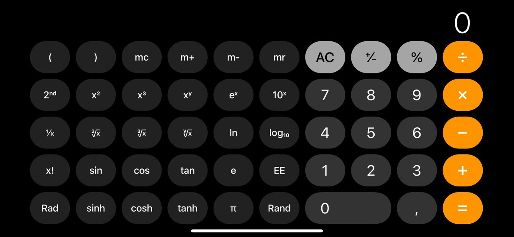
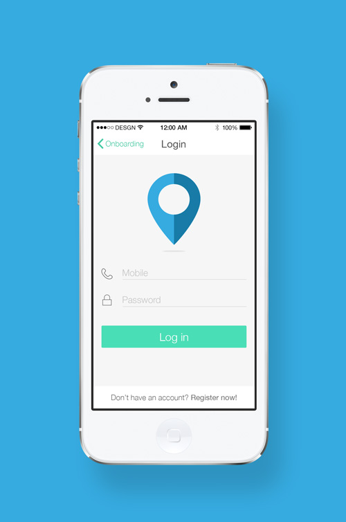

# Запуск проекта
Вам нужно скачать пакетный менеджер brew https://brew.sh/index_ru  
Затем с помощью него скачать cocoapods (brew install cocoapods)  
Затем в папке с проектом запустить команду pod install  
В проекте есть пример файла .swiftint.yml с правилами для проверки кода, которые использую я. Вас может это заинтересовать

# Домашка

## General  
Мои задания это чисто базовый пример. Если у вас есть идеи, реализуйте их, я проверю любой код. Главное чтобы задачи (например загрузка из сети или сохранение на диск) были выполнены

## 1) Star wars
Для домашнего задания предлагаю использовать https://swapi.co/ (любое другое открытое апи подойдет, я просто даю пример)
Минимальные ожидания - два экрана. Первый таблица с персонажами/фильмами, по нажатию на ячейку открывается второй экран с детальной информацией о персонаже/фильме. Есть кнопка закрыть или назад.

Дальнейшие изыскания:
- загрузить картинки на экране с деталями (аватарку фильма)
- задизайнить свою ячейку в таблице (добавить в нее аватарку)
- добавить несколько переходов (например на экране фильма показывать список кликабельных планет)
- впаять swiftlint
- удиви меня и получишь наклейку

Ответить на вопросы:
- Что такое SOLID?
- Что такое протокол? Отличие от класса?
- Что такое ARC? 
- В чем разница между weak и unowned?
- Расскажите про виды очередей в GCD?

## 2) Star wars extended
Я добавил в репозиторий проект TodoList. Он использует базу данных Realm, я привел примеры на базовые действия (попробуйте смахнуть ячейку влево или добавить нажав +). Можно попробовать https://github.com/stephencelis/SQLite.swift или CoreData, но Realm ИМХО легче всего для знакомства.  

Вы должны добавить в предыдущий проект работу с базой данных. Если интернет есть -> качаем, сохраняем базу, показываем. Если интернета нет, достаем из базы, показываем.

Дальнейшие изыскания:
- попробуйте создать ячейку отдельным Xib файлом
- поиграйтесь со стилями, научитесь менять шрифты, цвета, длину сепаратора в таблице. Попробуйте сделать это через код и через визуальный редактор
- реализовать и использовать в базе данных операции записи, чтения, поиска (например поиск по имени героя звездных войн)
- впаять swiftlint
- удиви меня и получишь наклейку

Ответить на вопросы:
- Что такое KISS и DRY?
- Что такое extension?
- Перечислите все способы работы с optional
- В чем разница Dependency Injection и Dependency Inversion? Пример?
- Что такое method dispatch? Какие типы бывают в свифте? (хардкор вопрос)

## 3) Autolayout pro

### Материлы
- Ссылка на интересный видос про autolayout: https://developer.apple.com/videos/play/wwdc2018/220  
- Ссылка на все то, что я рассказывал на лекции: https://developer.apple.com/library/archive/documentation/UserExperience/Conceptual/AutolayoutPG/index.html
- И по русски (меньше): https://habr.com/ru/company/oleg-bunin/blog/437584/
- И про метод диспатч: https://www.raizlabs.com/dev/2016/12/swift-method-dispatch/

### Домашка

Сделать копию дизайна калькулятора Apple. Нужно проверить, что верстка не едет на разных моделях айфонов. Логику счета реализовывать НЕ НУЖНО.
Все клавиши в landscape тоже не нужно, добавьте один столбик. Главное чтобы верстка была разной для portrait/landscape. Вам могут помочь size classes, о которых нужно почитать самим.

Дальнейшие изыскания (все это можно положить в одно приложение на разные экраны tabbar):
- сделать таблицу с динамической высотой ячеек (контент не важен)
- сделать что нибудь со scrollView (контент не важен). Например экран логина. Убедиться что кнопка доступна пользователю после показа клавиуатуры.

- удиви меня и получишь наклейку (Я ОБЕЩАЮ В ЭТОТ РАЗ ТОЧНО)

Ответить на вопросы:
- Что такое size class? Какие есть?
- Как сделать self-sizing cell?
- Я хочу поменять констрейнты/добавить из кода. В каком методе UIViewController/UIView нужно это делать?
- Что такое autoresizing masks?
- В чем отличие pixel от point в ios?
- Что такое method dispatch? Какие типы бывают в свифте? (хардкор вопрос)

## 4) Unit tests & storyboard separation
13 апреля моей лекции не будет, у вас есть много времени чтобы чет поделать. Домашки становятся меньше и проще, потому что, я надеюсь, что вы начали работать над проектами.

### Материалы:
- Про архитектуру наглядно: https://habr.com/ru/company/badoo/blog/281162/
- Чистые тесты и TDD: https://clean-swift.com/unit-testing-and-tdd-terminology/
- Еще немного про мотивацию: https://habr.com/ru/post/169381/
- Мой любимый (субъективно) фреймворк для написания тестов. Знаю точно что используется в АльфаБанке: https://github.com/Quick/Nimble
- Мой любимый (субъективно) фреймворк для работы со сторибордами, ячейками и xib. Чтобы не писать каждый раз `private let identifier = "..."`: https://github.com/AliSoftware/Reusable

### Домашка
1) Порефакторить проект StarWars (или то, что вы делали), вставить какую-нибудь архитектуру. Написать тесты (стаб нетворка). Например: проверить, что сущности загружаются, проверить, что ссылка на следующую страницу сохраняется.
2) Разбить Main.storyboard на несколько (один контроллер на сториборд). Переписать навигацию с Segues на UINavigationController

Ответить на вопросы:
- Отличие моков от стабов?
- Что такое view.frame и view.bounds? Чем отличаются?
- Content hugging priority и Content Resistant Priority? Что это? В чем разница?
- Рассказать про виды тестов (их по меньшей мере три).
- Расшифровать MVC, MVP, MVVM, VIPER, объяснить на пальцах какой слой за что отвечает и как взаимодействует с другими.

## 5) Леонардо дай винчик

### Материалы
- топ компаний: https://apptractor.ru/info/analytics/izvestnost-komand-mobilnoj-razrabotki-v-2019.htmlc
- бог и отец swift: https://twitter.com/clattner_llvm
- swift и ml (про это будет спикер): https://www.tensorflow.org/swift
- diff алгоритм инстаграмма: https://github.com/Instagram/IGListKit
- Рей Вендерлих про слои: https://www.raywenderlich.com/402-calayer-tutorial-for-ios-getting-started
- Frame vs Bounds: https://stackoverflow.com/questions/1210047/cocoa-whats-the-difference-between-the-frame-and-the-bounds

### Домашка
1) Любое творчество с анимацией и слоями. Не буду вас ограничивать, сделайте, чтобы было красиво. Используйте CAAnimationGroup, разные слои, покажите мне, что разобрались.
2) Анимируйте обновление таблички. Можно взять старое приложение (star wars) и добавить туда удаление людей из списка (swipe-to-delete). Хочу чтобы удаление и добавление новых (при скролле вниз) происходило с анимацией. Можно придумать что-то сложнее, можно использовать библиотеки (гуглите swift-diff-алгоритм). Метод `.reloadData()` видеть НЕ хочу

Ответить на вопросы:

1) Что такое CALayer? Зачем нужен? Отличие от UIView?
2) Что такое Explicit/implicit анимация?
3) Что такое layer model/presentation? В каких ситуациях у layer model/presentation разные значения?
4) Кто получает событие первым UIView или GestureRecognizer на нем?
5) Как рисовать на CPU, а как на GPU? (кто ответит на вопрос получит пиво)

